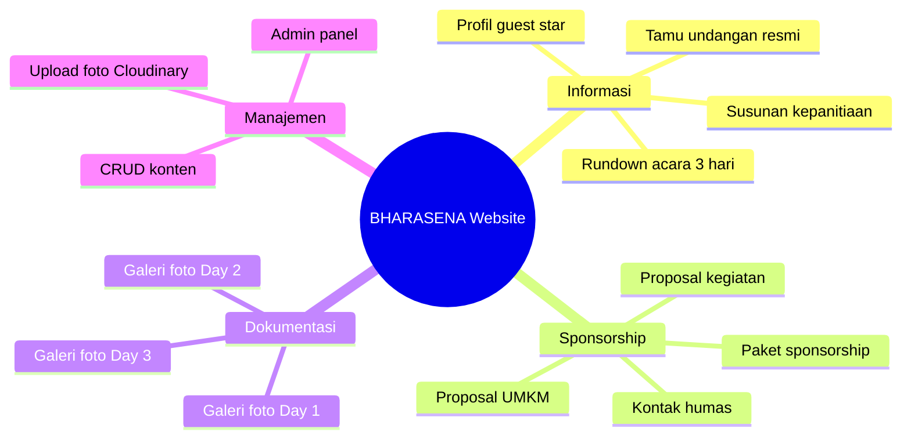
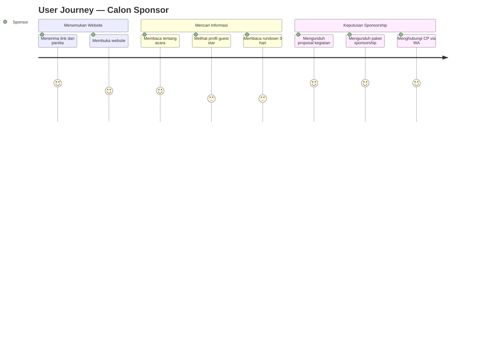
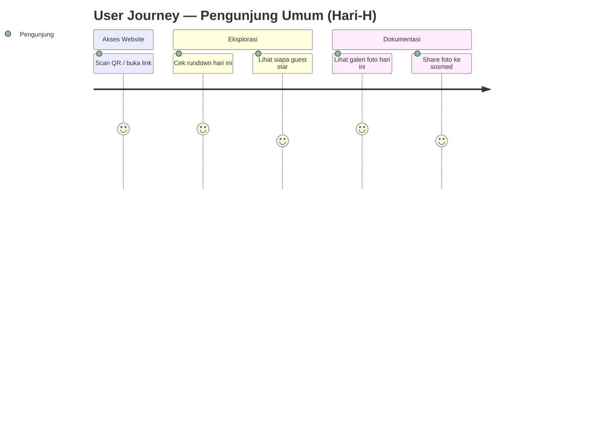
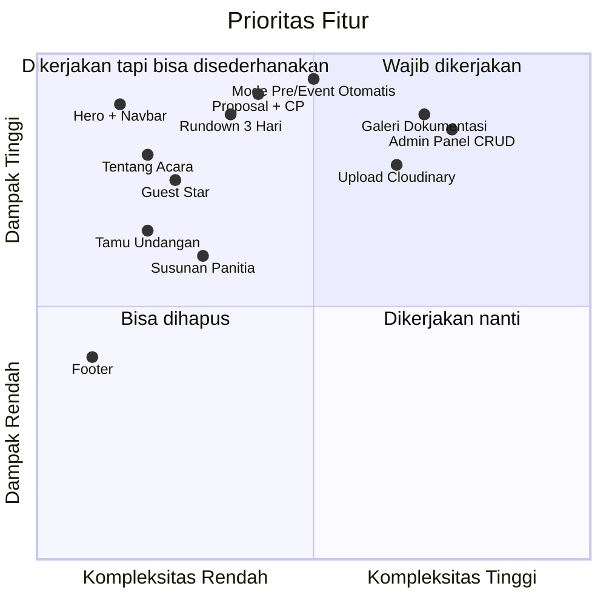
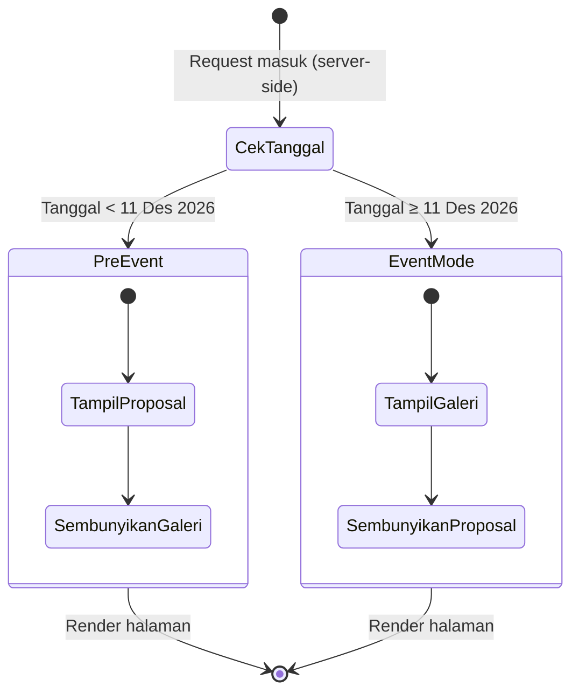
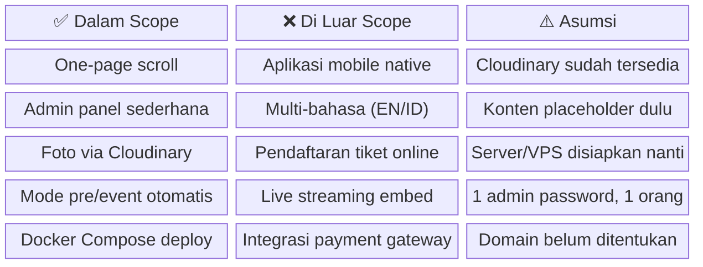
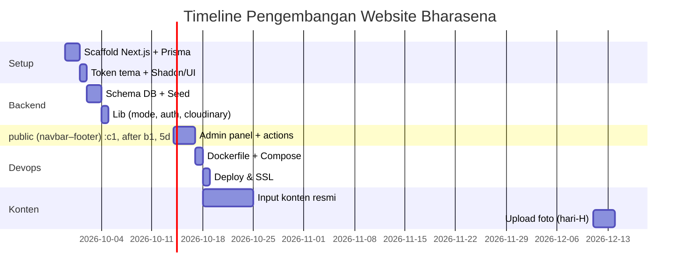

# PRD — Product Requirements Document
## Website Informasi Prom Night BHARASENA
**Batalyon Bhara Arsa Nawasena · SMAN 2 Taruna Bhayangkara**
**Versi 1.0 · September 2026**

---

## 1. Ringkasan Produk

Website one-page scroll sebagai portal informasi resmi Prom Night Taruna Bhayangkara 6 — BHARASENA (11–13 Desember 2026). Website berfungsi ganda: menarik sponsor sebelum acara, dan mendokumentasikan momen selama acara berlangsung.

---

## 2. Tujuan Produk

---

## 3. Pengguna & Kebutuhan

---

## 4. Fitur & Prioritas

---

## 5. Logika Mode Konten

---

## 6. Batasan & Asumsi

---

## 7. Timeline Pengembangan

---

*Dokumen ini merupakan bagian dari paket dokumentasi Bharasena Website v1.0*
