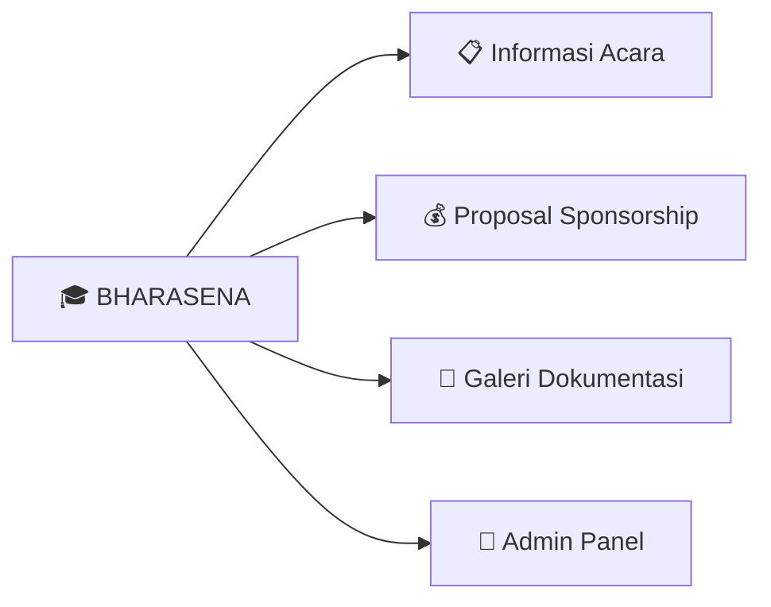
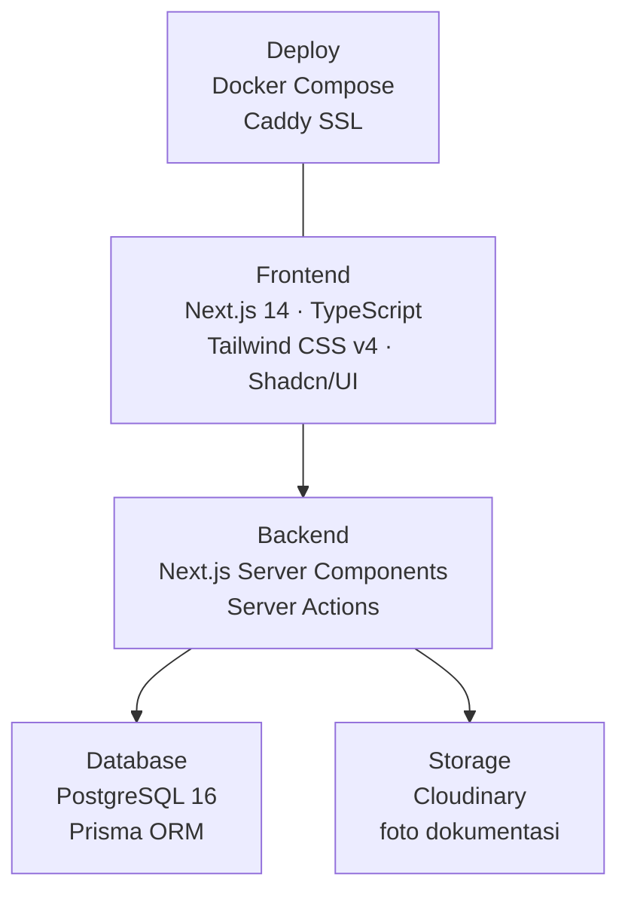
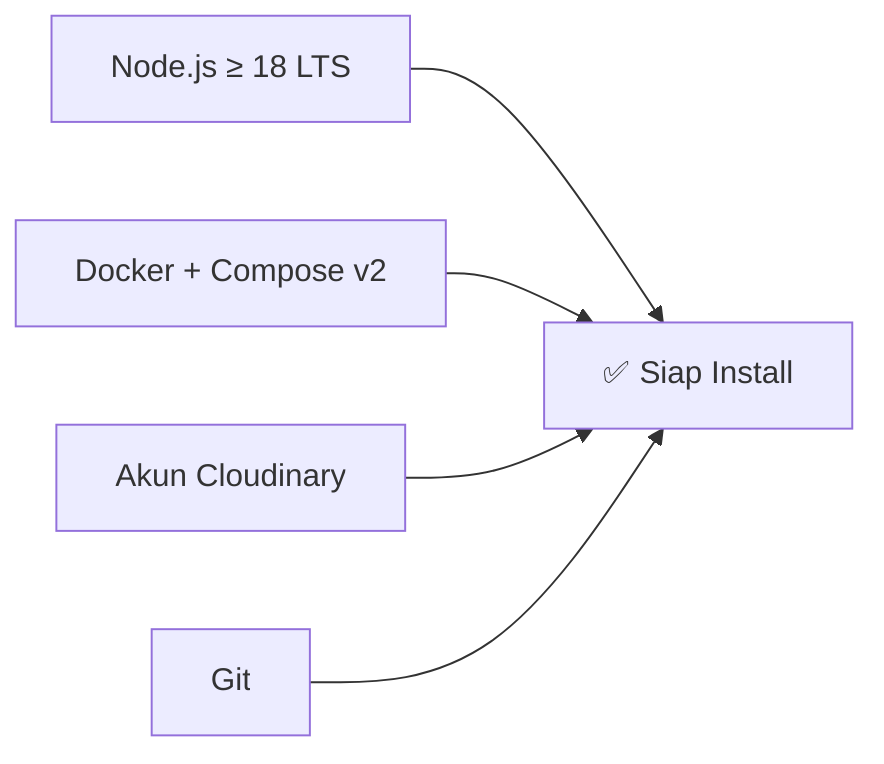
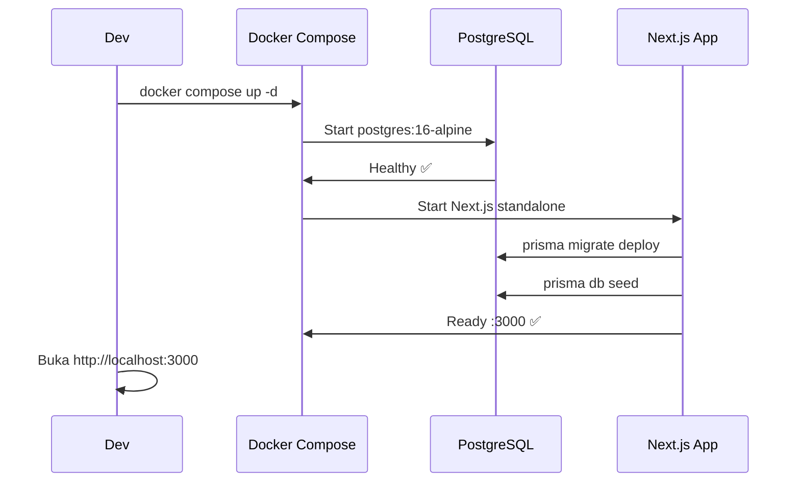
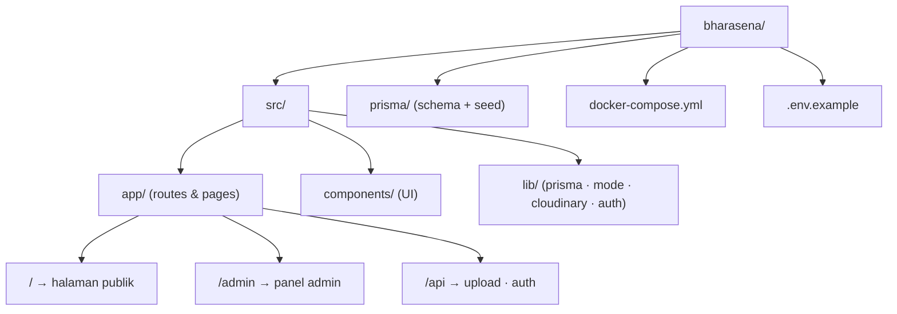
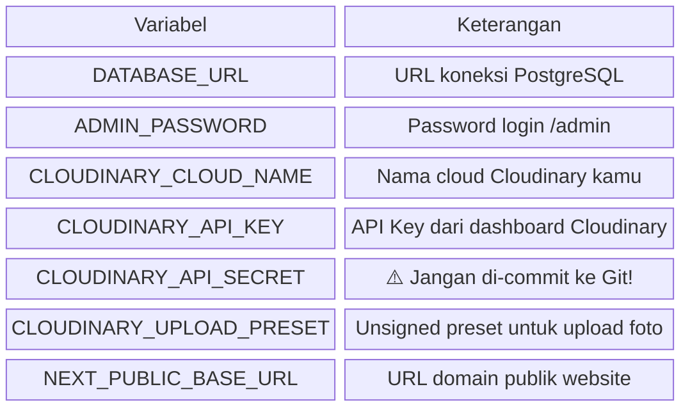
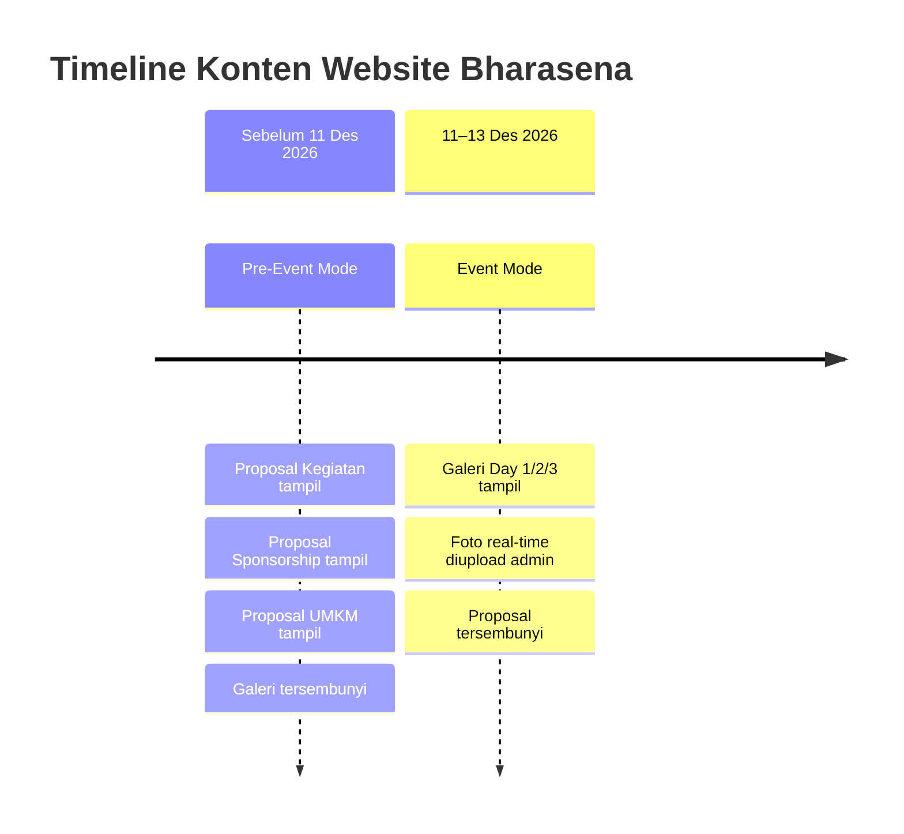
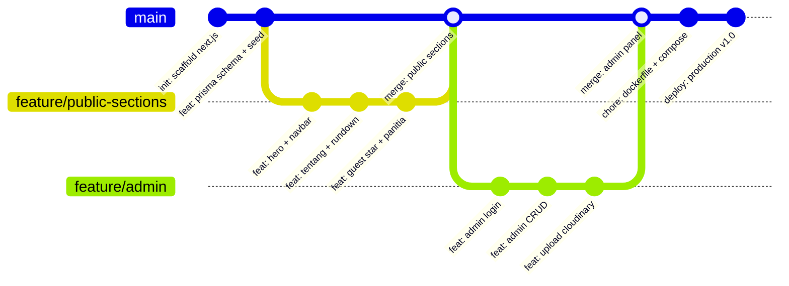

# BHARASENA — Website Prom Night Taruna Bhayangkara 6
> Batalyon Bhara Arsa Nawasena · SMAN 2 Taruna Bhayangkara · 11–13 Desember 2026



---

## Stack



---

## Prasyarat



---

## Instalasi & Menjalankan

### 1. Clone & Setup Env

```bash
git clone https://github.com/codeplyapp/Bharasena.git
cd Bharasena
cp .env.example .env
# Isi semua variabel di .env
```

### 2. Jalankan dengan Docker Compose

```bash
docker compose up -d
```



### 3. (Alternatif) Development Lokal

```bash
npm install
npx prisma migrate dev
npx prisma db seed
npm run dev
```

---

## Struktur Folder



---

## Konfigurasi Environment



---

## Cara Kerja Mode Pre-Event vs Event



---

## Perintah Berguna

```bash
# Masuk ke admin panel
open http://localhost:3000/admin

# Reset database & seed ulang
npx prisma migrate reset

# Build production
npm run build

# Cek tipe TypeScript
npm run typecheck

# Lint
npm run lint

# Deploy ulang setelah update kode
docker compose build && docker compose up -d
```

---

## Kontribusi (Tim Panitia Dev)



---

## Lisensi

Proyek internal Prom Night SMAN 2 Taruna Bhayangkara · Batalyon Bhara Arsa Nawasena 2026.
Tidak untuk distribusi publik.

---

*BHARASENA · Bhara Arsa Nawasena · Batalyon 6 · 2026*
