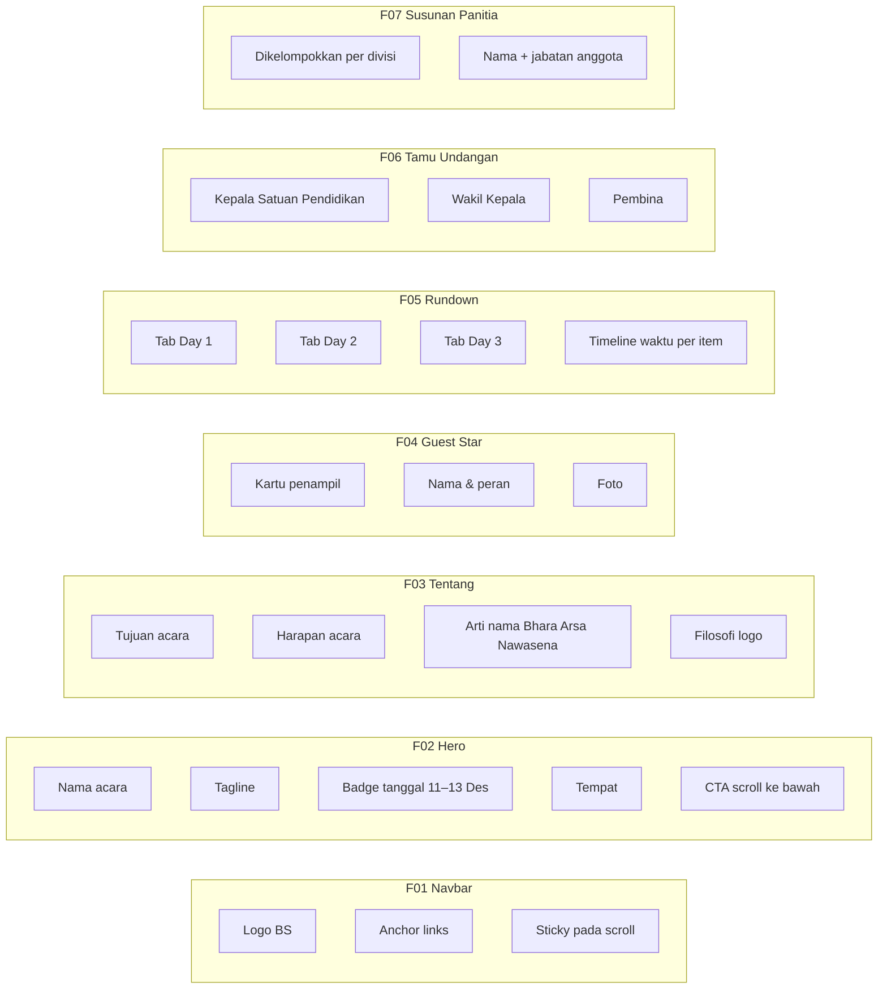
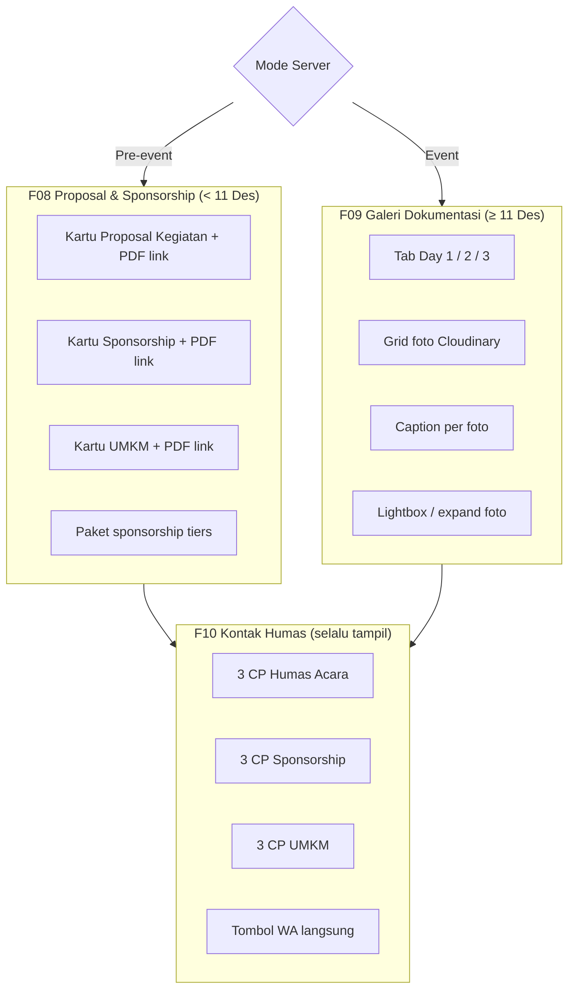
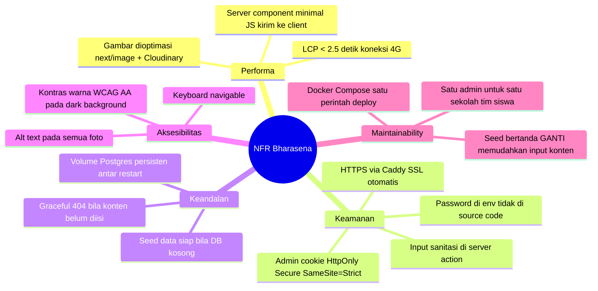
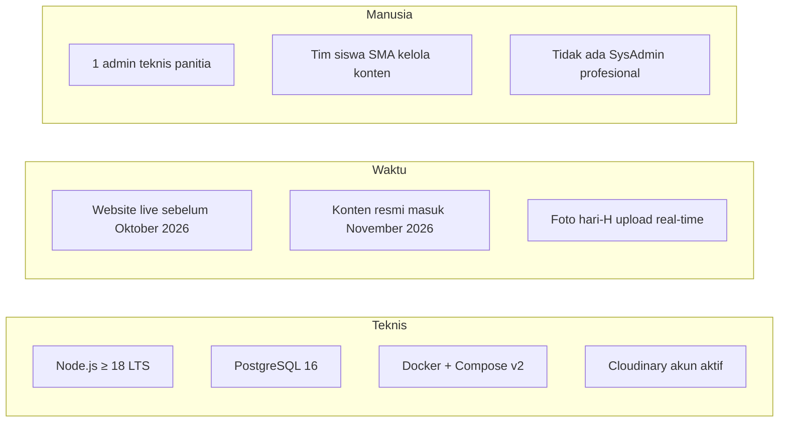
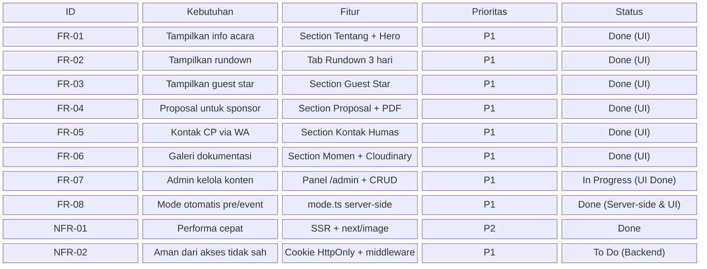

# SRS — Software Requirements Specification
## Website Informasi Prom Night BHARASENA
**Batalyon Bhara Arsa Nawasena · SMAN 2 Taruna Bhayangkara**
**Versi 1.0 · September 2026**

---

## 1. Pengantar

Dokumen ini mendefinisikan kebutuhan fungsional dan non-fungsional sistem website BHARASENA, mengikuti format IEEE 830. Sistem ini adalah aplikasi web one-page untuk Prom Night Taruna Bhayangkara 6 yang berlangsung pada 11–13 Desember 2026.

---

## 2. Use Case Diagram

```mermaid
graph TD
    subgraph Aktor
        P[👤 Pengunjung Umum]
        S[💼 Calon Sponsor]
        A[🔐 Admin Panitia]
    end

    subgraph Website Bharasena
        UC1[Lihat informasi acara]
        UC2[Lihat rundown 3 hari]
        UC3[Lihat guest star]
        UC4[Lihat tamu undangan]
        UC5[Lihat susunan panitia]
        UC6[Unduh proposal kegiatan]
        UC7[Unduh proposal sponsorship]
        UC8[Unduh proposal UMKM]
        UC9[Hubungi CP via WhatsApp]
        UC10[Lihat galeri dokumentasi]
        UC11[Login ke admin panel]
        UC12[CRUD semua konten]
        UC13[Upload foto dokumentasi]
        UC14[Override mode pre/event]
    end

    P --> UC1
    P --> UC2
    P --> UC3
    P --> UC4
    P --> UC5
    P --> UC10

    S --> UC1
    S --> UC6
    S --> UC7
    S --> UC8
    S --> UC9

    A --> UC11
    A --> UC12
    A --> UC13
    A --> UC14

    style A fill:#B93636,color:#fff
    style S fill:#FFCB56,color:#1e1e1e
```



---

## 3. Kebutuhan Fungsional

### 3.1 Section Publik



### 3.2 Section Kondisional



### 3.3 Admin Panel

```mermaid
flowchart TD
    LOGIN[/admin/login] -->|Password benar| PANEL[Dashboard /admin]

    PANEL --> TAB1[Tab: Tentang]
    PANEL --> TAB2[Tab: Guest Star]
    PANEL --> TAB3[Tab: Rundown]
    PANEL --> TAB4[Tab: Undangan]
    PANEL --> TAB5[Tab: Panitia]
    PANEL --> TAB6[Tab: Proposal & CP]
    PANEL --> TAB7[Tab: Dokumentasi]
    PANEL --> LOGOUT[Logout]

    TAB7 --> UP1[Pilih Day 1/2/3]
    TAB7 --> UP2[Upload foto ke Cloudinary]
    TAB7 --> UP3[Isi caption]
    TAB7 --> UP4[Atur urutan]
    TAB7 --> UP5[Hapus foto]

    style LOGIN fill:#B93636,color:#fff
    style PANEL fill:#1e1e1e,color:#FFCB56
```

---

## 4. Kebutuhan Non-Fungsional



---

## 5. Constraint Sistem



---

## 6. Matriks Kebutuhan vs Fitur



---

*Dokumen ini merupakan bagian dari paket dokumentasi Bharasena Website v1.0*
