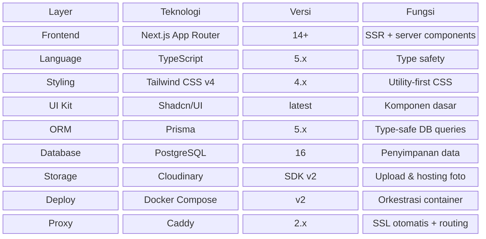
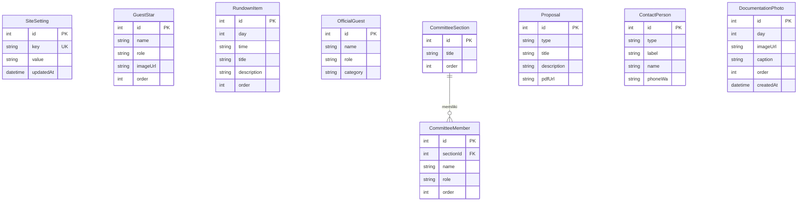
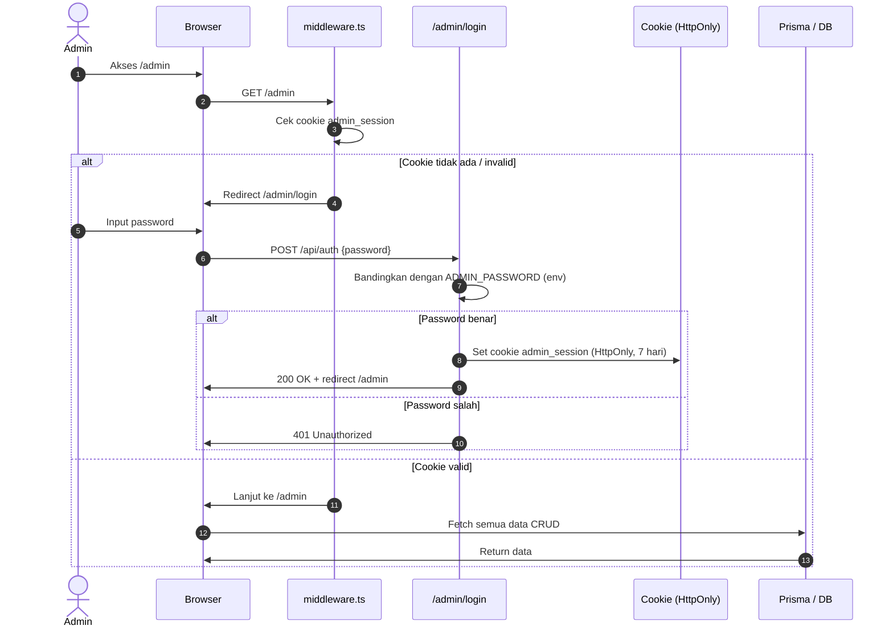
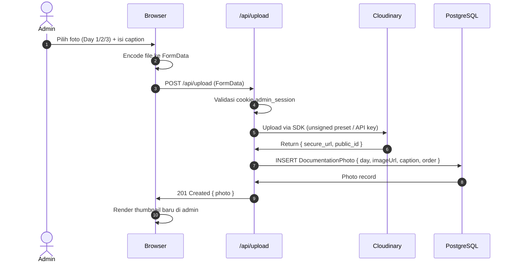
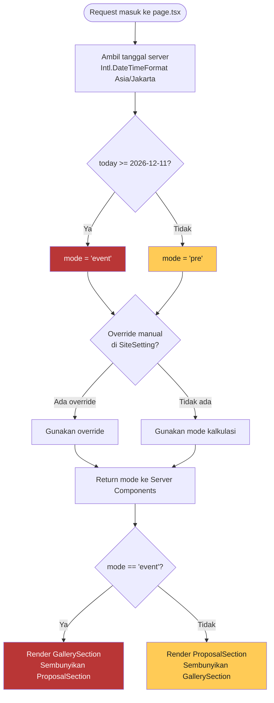
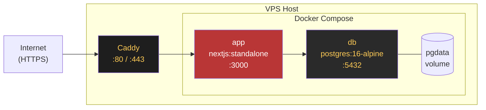
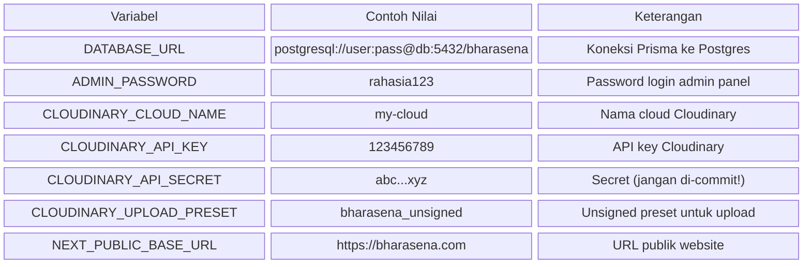

# TSD — Technical Specification Document
## Website Informasi Prom Night BHARASENA
**Batalyon Bhara Arsa Nawasena · SMAN 2 Taruna Bhayangkara**
**Versi 1.0 · September 2026**

---

## 1. Arsitektur Sistem

---

## 2. Stack Teknologi

---

## 3. Struktur Folder Proyek

```mermaid
graph TD
    ROOT[bharasena/] --> SRC[src/]
    ROOT --> PRISMA[prisma/]
    ROOT --> DOCKER[docker-compose.yml]
    ROOT --> ENV[.env.example]
    ROOT --> DOCKERFILE[Dockerfile]
    ROOT --> MIDDLEWARE[middleware.ts]

    SRC --> APP[app/]
    SRC --> LIB[lib/]
    SRC --> COMP[components/]

    APP --> PAGE["page.tsx (/)"]
    APP --> GLOBALS["globals.css (Tailwind v4 @theme)"]
    APP --> LAYOUT["layout.tsx"]
    APP --> ADMIN["admin/"]
    APP --> API["api/"]

    ADMIN --> ADMINPAGE["page.tsx"]
    ADMIN --> ADMINLOGIN["login/page.tsx"]

    API --> APIUPLOAD["upload/route.ts"]
    API --> APIAUTH["auth/route.ts"]

    LIB --> LIBPRISMA["prisma.ts"]
    LIB --> LIBMODE["mode.ts"]
    LIB --> LIBDATA["data.ts"]
    LIB --> LIBTYPES["types.ts"]
    LIB --> LIBMOCK["mock/data.ts"]
    LIB --> LIBSECT["sections.ts"]
    LIB --> LIBIMG["images.ts"]
    LIB --> LIBCLOUD["cloudinary.ts"]
    LIB --> LIBAUTH["auth.ts"]

    COMP --> COMPNAV["Navbar.tsx"]
    COMP --> COMPHERO["Hero.tsx"]
    COMP --> COMPSECT["sections/"]
    COMP --> COMPADMIN["admin/"]
    COMP --> COMPUI["ui/ (shadcn)"]
    COMP --> COMPFOOT["Footer.tsx"]

    PRISMA --> SCHEMA["schema.prisma"]
    PRISMA --> SEED["seed.ts"]

    style ROOT fill:#1e1e1e,color:#FFCB56
    style SRC fill:#2a2a2a,color:#fff
    style PRISMA fill:#2a2a2a,color:#fff
    style LIB fill:#B93636,color:#fff
    style APP fill:#B93636,color:#fff
```

---

## 4. Skema Database (ERD)

---

## 5. Alur Autentikasi Admin

---

## 6. Alur Upload Foto Dokumentasi

---

## 7. Logika Mode Server (mode.ts)

---

## 8. Docker Compose & Deployment

---

## 9. Environment Variables

---

*Dokumen ini merupakan bagian dari paket dokumentasi Bharasena Website v1.0*
