# User Manual — Website BHARASENA
## Panduan Penggunaan untuk Admin & Pengunjung
**Prom Night Taruna Bhayangkara 6 · SMAN 2 Taruna Bhayangkara · 2026**

---

## Bagian A: Panduan Pengunjung

### A.1 Cara Navigasi Website

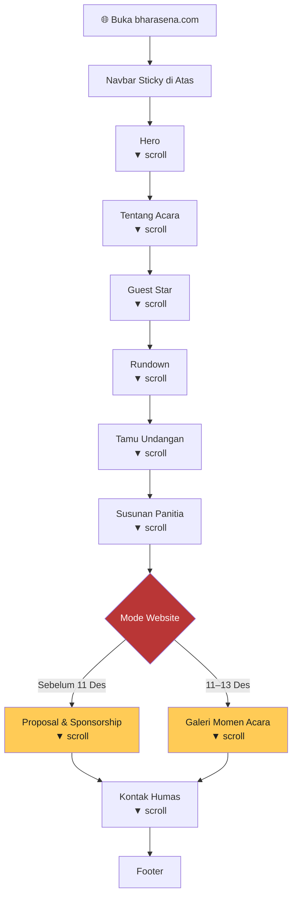

---

### A.2 Cara Melihat Rundown

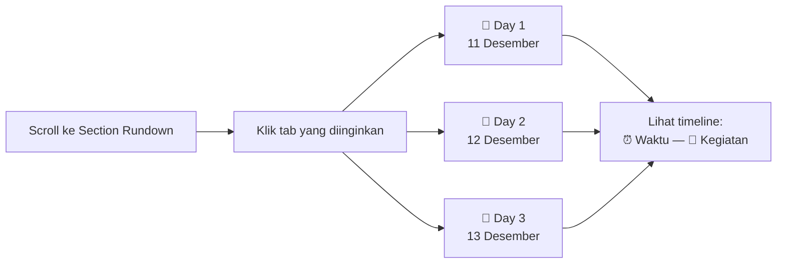

---

### A.3 Cara Mengunduh Proposal (Calon Sponsor)

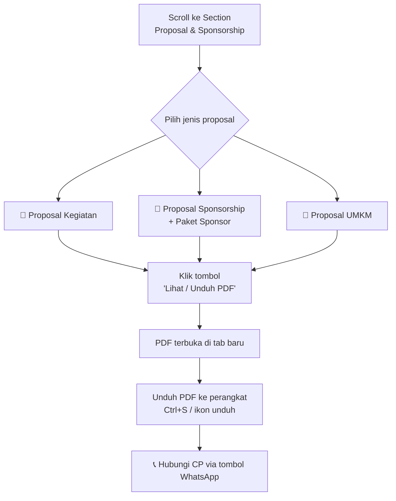

---

### A.4 Cara Menghubungi Panitia

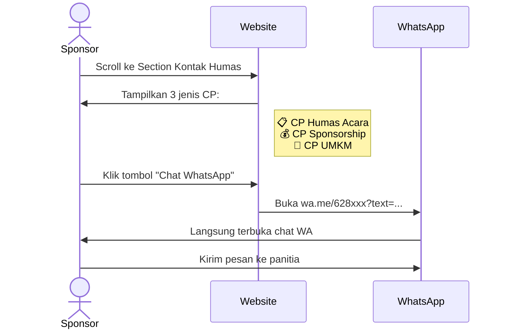

---

### A.5 Cara Melihat Galeri Dokumentasi (Saat & Setelah Acara)

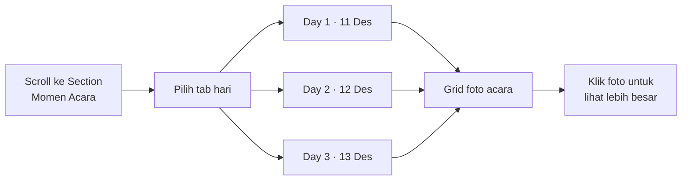

---

## Bagian B: Panduan Admin Panitia

### B.1 Cara Login ke Admin Panel

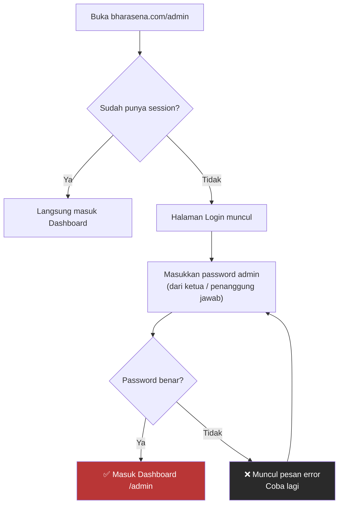

> ⚠️ **Penting:** Password tidak disimpan di manapun di website. Minta dari penanggung jawab teknis panitia.

---

### B.2 Navigasi Admin Panel

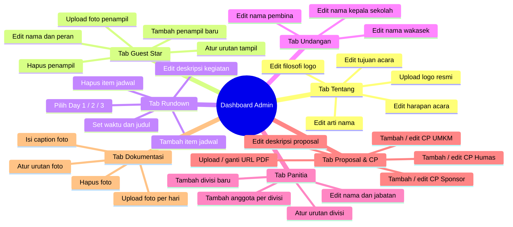

---

### B.3 Cara Mengedit Konten "Tentang"

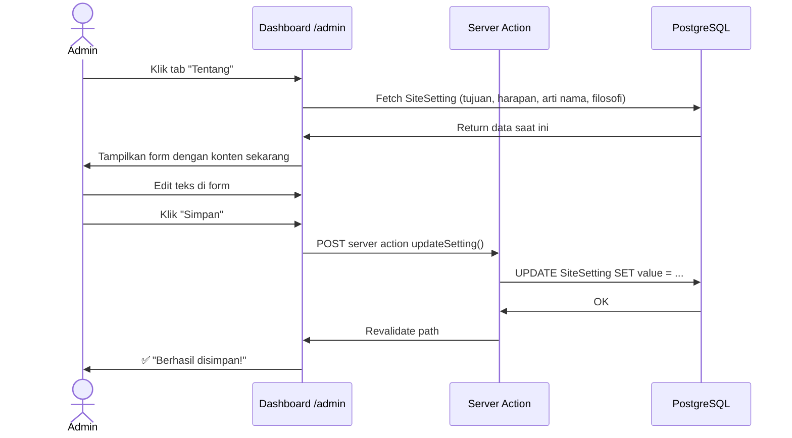

---

### B.4 Cara Upload Foto Dokumentasi

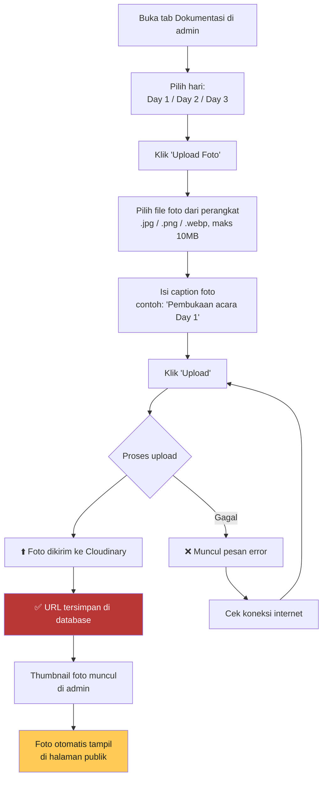

---

### B.5 Cara Mengatur Urutan Tampil

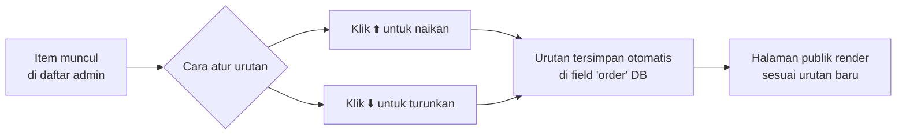

---

### B.6 Cara Logout

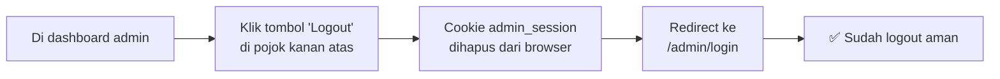

---

### B.7 Alur Kerja Admin Saat Hari-H

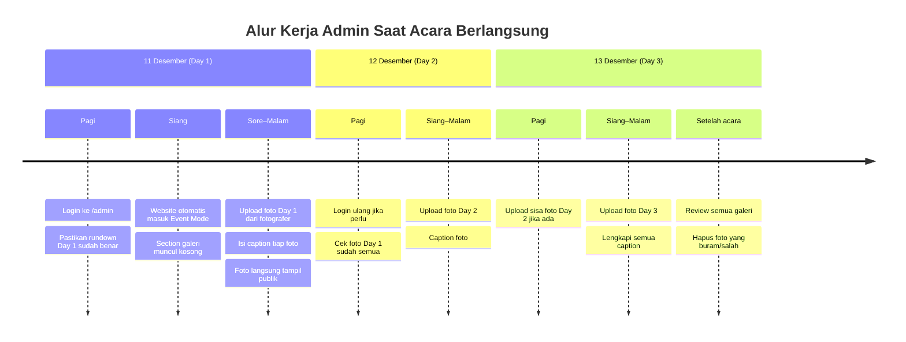

---

### B.8 Troubleshooting Admin

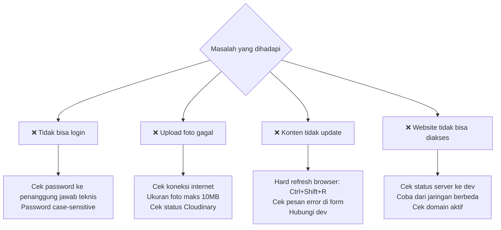

---

## Kontak Tim Teknis

Untuk pertanyaan teknis seputar website, hubungi penanggung jawab dev panitia BHARASENA.

---

*User Manual ini merupakan bagian dari paket dokumentasi Bharasena Website v1.0*
*BHARASENA · Bhara Arsa Nawasena · Batalyon 6 · SMAN 2 Taruna Bhayangkara · 2026*
